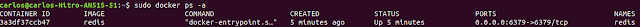

# SpringRedis
Projeto para estudar a utilização no redis em aplicações Spring com o banco de dados H2.

# Requisitos

Projeto desenvolvido em ambiente Windows

Para rodar a imagem com o Redis é necessário ter instalado em seu computador o Docker pelo link:  https://www.docker.com/

ATENÇÃO: Alguns problemas na instalação do Docker, podem necessitar a configuração da Maquina para virtualização na sua (BIOS) e Ativação do Hyper-V nos recursos do windows.

# Criando container
docker pull redis
docker run --name redis -p 6379:6379 -i -t -d redis

Para verificarmos se o contâiner realmente foi criado, basta rodar o comando:   docker ps -a

Assim que o comando for executado você poderá encontrar todos os contâiners existentes em seu sistema operacional 
e entre eles deve ter o Redis como mostrado na imagem abaixo:

# Como funciona o projeto
Após as configurações, o projeto está pronto para utilizar cache com Redis, para isso, assim nas camadas de serviço é possibilitado maior reaproveitamento dos caches, onde podem ser chamados através de endpoints (Controllers) ou por outros serviços locais.

Exemplo: Existem 3 companys cadastradas no banco de dados H2, assim que for realizado a primeira requisição a aplicação irá efetuar a busca no banco de dados H2 e disponibilizar esses dados em Cache, para que em futuras consultas caso exista um Cache válido não seja necessário realizar uma nova busca no banco de dados. A cada interação de insert/update/delete é alterado o status do cache para que seja novamente necessário buscar os dados no banco de dados.

# Requisições para efetuar testes
curl -s http://localhost:8080/company \
 -H "Content-Type: application/json" \
 -d '{"identifier": "1010", "name": "Company 1"}'

curl -s http://localhost:8080/company \
 -H "Content-Type: application/json" \
 -d '{"identifier": "1020", "name": "Company 2"}'

curl -s http://localhost:8080/company \
 -H "Content-Type: application/json" \
 -d '{"identifier": "1030", "name": "Company 3"}'

curl -s http://localhost:8080/company \
 -H "Content-Type: application/json" \
 -d '{"identifier": "1040", "name": "Company 4"}'
curl -s http://localhost:8080/company/
curl -s -X PUT http://localhost:8080/company \
 -H "Content-Type: application/json" \
 -d '{"identifier": "1010", "name": "Company 1010"}'
curl -s http://localhost:8080/company/1010
curl -s -X DELETE http://localhost:8080/company/1040 
